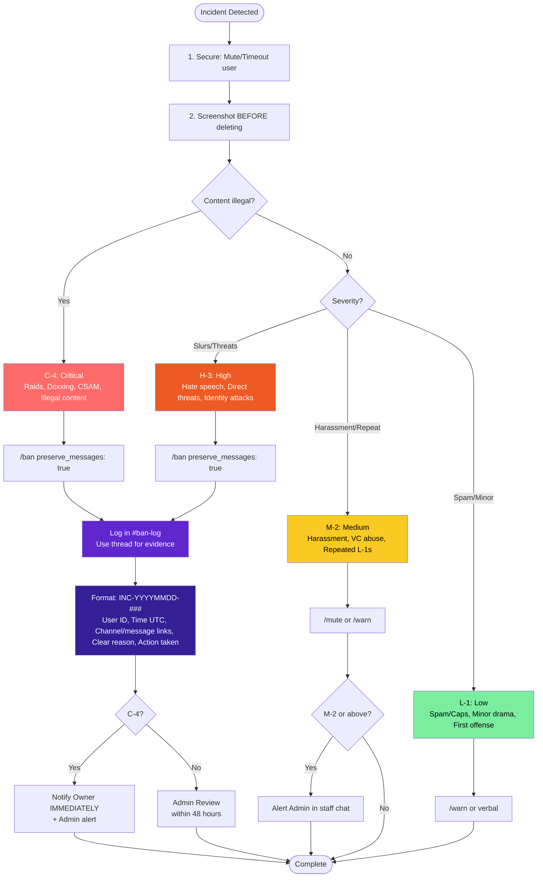

# Staff Handbook

**This is the main staff documentation.** Everything you need is here or linked from here.

---

## What do you need?

| I need to... | Go here |
|--------------|---------|
| **Verify an artist application** | [Commissions Verification](#commissions-verification) |
| **Use bot commands** | [Bot Handbook](BOT-HANDBOOK.md) |
| **Handle a moderation issue** | [Moderation Protocols](#moderation-protocols) |
| **Report an incident** | [Incident Reporting](#incident-reporting) |
| **Learn about the art program** | [Server Artist Program](#server-artist-program) |
| **Check what commands I can use** | [Permissions Matrix](PERMS-MATRIX.md) |
| **Quick command lookup** | [Quick Reference](MOD-QUICKREF.md) |

---

## New Staff? Start here:

1. Read [Staff Roles](#staff-roles): understand the hierarchy
2. Read [Conduct & Expectations](#conduct--expectations): what we expect from you
3. Read [Training Guide](#training-guide): how onboarding works

---

## 🆕 Commissions Verification System

**New as of December 2025.** This is how we verify artist applications to prevent fraud and AI art.

→ [Jump to Commissions Verification](#commissions-verification)

Key features:
- Red/green flag checklists
- AI detection guide
- Proof requirements for 2D, 3D, music, and fursuits
- Quick reference card

---

## Role-Specific Guides

| Your Role | Guide |
|-----------|-------|
|   | [Gatekeeper Guide](GATEKEEPER-GUIDE.md) |
|   | [Moderator Guide](MODERATOR-GUIDE.md) |
|   | [Admin Guide](ADMIN-GUIDE.md) |
|    | [Leadership Guide](LEADERSHIP-GUIDE.md) |

---

## All Sections

**Basics**
- [Staff Roles](#staff-roles)
- [Conduct & Expectations](#conduct--expectations)
- [Training Guide](#training-guide)

**Key Systems**
- [Commissions Verification](#commissions-verification) -- **NEW**
- [Moderation Protocols](#moderation-protocols)
- [Incident Reporting](#incident-reporting)

**Reference**
- [Community Rules](#community-rules)
  - [Roleplay & Spam](#roleplay--spam)
  - [User Safety](#user-safety)
- [Cross Banning & Drama](#cross-banning--drama)
- [Ticket Guide](#ticket-guide)
- [Server Artist Program](#server-artist-program)
- [Audit Tools](#audit-tools)

---

## Staff Roles

The hierarchy below lists every staff role in rank order. Each entry describes the responsibilities the role carries here. Role IDs and the full permission matrix live in [PERMS-MATRIX.md](PERMS-MATRIX.md).

### Community Founder

- The role currently held by the server owner.
- Sets overall direction for the community and has final say on appeals and policy.
- Older docs and code constants refer to this rank as "Server Owner"; the live Discord name is "Community Founder".

### Community Manager(s)

- Leads and supervises the entire staff team.
- Handles server-wide initiatives, announcements, and events.
- Reviews staff performance and manages internal systems and communications.
- Coordinates with moderators and administrators on high-impact community actions.
- Represents server leadership in community interactions.

### Community Development Lead

- Owns staff development, training pipelines, and cross-team coordination.
- Works with the Community Manager on team structure and onboarding.

### Senior Administrator / Administrator

- Maintains day-to-day technical aspects of the server (channels, permissions, etc.).
- Supports moderation and ensures rules, bots, and internal tools are functioning.
- Assists with documentation and setup tasks; not responsible for community-wide direction.
- Works with Senior Moderators and Moderators to ensure reports and issues are addressed correctly.
- Senior Administrators handle audit-level operations and act as escalation for Administrators.

### Senior Moderator(s)

- Oversees moderators and ensures proper enforcement of rules.
- Reviews and handles escalated or sensitive moderation cases.
- Provides training and mentorship to new mods.
- Acts as liaison between Mods and Admins/Community Managers.

### Moderator(s) / Junior Moderator(s)

- Enforces rules fairly and consistently across the server.
- Manages behavior in text and voice channels.
- Uses appropriate tools (warn, mute, kick, ban) following the server's escalation guidelines.
- Files proper modlogs and communicates issues internally.
- Maintains a helpful, approachable presence within the community.
- Junior Moderators handle the same day-to-day moderation work as Moderators with closer mentor oversight; they typically do not take lead on H-3 cases.

### Gatekeeper

- Reviews join applications, accepts/rejects/kicks via the gate flow.
- Does not handle in-server moderation actions.
- See the [Gatekeeper Guide](GATEKEEPER-GUIDE.md) for the full workflow.

### Community Staff (broad mod role)

- The catch-all "mod-perm" role attached to most staff roles.
- Carries `ManageMessages`, `MentionEveryone`, and `ModerateMembers` Discord perms.
- Used by ticket panels and `/report` to grant staff access without naming each individual rank.
- Older code constants and docs call this role "Moderation Team"; the live Discord name is "Community Staff".

### Community Ambassador

- Non-moderator member-support role.
- Can use `/report` to escalate violations they handle (delete + screenshot first, document with the report).
- Cannot ban, mute, or take direct moderation actions.

### Bypass roles

These two are not part of the rank-and-file staff hierarchy but bypass every permission check:

- **Server Dev**: staff role intended for engineers maintaining the bot. Treated as "above everyone" by `src/lib/roles.ts`.
- **Bot Owner**: single hardcoded user ID at the top of the bypass chain.

If a permission-denied embed says you need a role you don't have, it is showing the live Discord role names. You may also see "Community Staff" or "Community Founder" rendered in the bot's responses where older docs say "Moderation Team" or "Server Owner".

---

## Conduct & Expectations

You're held to a higher standard than regular members because the rest of the community takes its cues from how you act. Be helpful, be friendly, and don't take the role for granted.

**Key principles:**

- First impressions matter. How you act is how the community sees you.
- Represent the server professionally and respectfully.
- Stay neutral in conflicts. Don't argue with members in public.
- Don't use your permissions for personal gain or vendettas.
- Follow the server rules yourself: you're held to a higher standard, not a lower one.
- Be transparent. Always leave a log and a reason.
- Respect the chain of command.

### Professionalism

Stay composed during heated conversations. Emotional reactions escalate situations that could have ended quietly.

Use discretion with sensitive topics. Bans, reports, and member disputes stay in staff channels.

### Attitude & Demeanor

Treat every member the same regardless of how long they've been around or how popular they are. Lead by example: your tone sets the tone for everyone watching.

### Responsiveness & Engagement

Respond to mod pings reasonably quickly. If you can't be available, set your status or tell the team.

Stay involved in everyday activity. Greeting people, cleaning up spam, answering questions in general: that's most of the job.

Track tasks where the team can see them: Trello, bot logs, or the dedicated staff channels. Don't just remember things in your head.

### Accountability

If you make a bad call, say so and tell senior staff. We'd rather hear about it from you than discover it later.

Log every moderation action with the reason, evidence, and context. That goes double for kicks, bans, and warns.

Ask for help when you're not sure. Guessing on a decision that affects another member is how we end up reversing actions later.

### Team Collaboration

Present a unified front to members. If you disagree with another staff member's call, take it up with them in staff channels, not in front of users.

Keep feedback between staff members private and constructive.

Don't clutter moderation channels with casual chatter. They exist for tracking actions, not for hanging out.

### Prohibited Conduct

- Don't abuse permissions. That means no role edits, message deletions, or mutes without a reason you can defend.
- No favoritism. Friends and regulars get held to the same rules as everyone else.
- Don't share staff discussions. Screenshots, summaries, and leaks of internal conversations are grounds for immediate removal.
- Don't vent about users or other staff in public channels. Keep that for DMs or staff chat.

### Transparency

Log decisions accurately. Reports should include the time, the user, and what actually happened.

Keep emotion out of the log. Stick to facts: your feelings about the user belong somewhere else.

Explain your actions in mod channels when you can. It keeps the team aligned and gives anyone reviewing the case the context they need.

---

## Moderation Protocols

### Warning Level System

We manage a multi-tier 3-strike system. Each warning level has different severity and decay periods. Staff make notes on users to track offenses and determine correct action.

| Level | Name | Decay Period | Notes |
|-------|------|--------------|-------|
| **L-1** | Low/Minor | Falls off after 30 days | Spam, caps, minor drama |
| **M-2** | Medium | Falls off after 2 months | Harassment, VC abuse, repeated offenses |
| **H-3** | High/Major | **Never falls off** | Hate speech, threats, slurs |

**Important:** H-3 (Major) offenses remain on record permanently if the user hasn't been removed prior.

### Escalation Guidelines

We are a 3 strike rule community. Any minor or medium infraction may follow this rule. Please use discretion when making actions. All moderation actions are reviewed by Community Managers & Administrators.

#### L-1: Minor Infractions
*Examples: Spam, Caps, Drama*

| Offense | Action |
|---------|--------|
| First | Verbal/Written Warn |
| Second | Mute (2 Hours) |
| Third/Final | Mute (2 days) |

Repeated offenses after will result in a removal from the community.

#### M-2: Medium Infractions
*Examples: Toxic Behavior, Harassment, Suggestive topics*

| Offense | Action |
|---------|--------|
| First | Written Warn |
| Second | Mute (3 Days) |
| Third/Final | Removal from the community |

#### H-3: Major Infractions
*Examples: Slurs, Threats, Raiding*

| Offense | Action |
|---------|--------|
| First/Final | Automatic Ban |

#### Special Cases

| Violation | Action | Notes |
|-----------|--------|-------|
| Adult/18+ Content | Automatic 3-Strike | Discussion of 18+ topics |
| DM Advertising | Ban | Unsolicited DMs about selling |
| Trolling/Raiding | Automatic Ban | Immediate removal |

### How to File Actions

Running a community, people will break the rules. It happens in the real world as much as it happens on Discord. Below will give you a brief guide on how it works. All moderation actions will be utilized under Dyno /commands.

All moderation actions must be done in the mod-actions channel unless there is an immediate need to remove a user from the community (e.g., User spamming Slurs, etc.).

#### Verbal/Written Warnings

**Verbal Warnings:** Verbal Warns are warnings towards a user for violating the rules. It does not have to be to manually logged with any of the moderation bots. You may communicate it with the team if needed but not required.

**Written Warnings:** Written Warns have to be manually logged. You may use Dyno to log your warning.

```
/warn user: @user reason: Reason for the warn
```

#### Muting

Mutes: Muting can be an effective tool to halt users in their tracks from committing more rule breaks. It may stop a large argument between two users.

```
/mute user: @user limit: (e.g, 5m, 3h, 1d) reason: Reason for the mute
```

*Please follow our escalation guidelines for duration.*

#### Kicking/Banning

**Kicks:** Kicking removes a user from the server. However, the user can rejoin at anytime. Unlike where a ban is permanent. It can be used in scenarios where a user has violated a set of rules after an event. This is a much softer approach than a ban.

```
/kick user: @user reason: Reason for the kick
```

**Bans:** Banning a user is an effective but a last resort tool to moderate users. Such as a troll, someone saying slurs or just overly violating the rules.

```
/ban user: @user reason: Reason for the ban duration: (if temp ban) preserve_messages: true no_appeal: false
```

**Important:**
- Set `preserve_messages` to `true` to contain evidence for ban-log
- Set `no_appeal` to `false` or leave blank
- ALL BANS MUST BE MANUALLY LOGGED in ban-log
- Only exception is bans prior to gatekeeping (e.g., a troll joining and spamming slurs)

---

## Incident Reporting

This section covers how to respond to incidents fairly, document them clearly, and keep everyone accountable.

### Incident Types

| Level | Name | Examples | Decay |
|-------|------|----------|-------|
| L-1 | Low | Minor spam, general warnings | 30 days |
| M-2 | Medium | Harassment, VC abuse, repeated offenses | 2 months |
| H-3 | High | Hate speech, direct threats, identity attacks | Never |
| C-4 | Critical | Raids, doxxing, illegal content distribution | N/A (Ban) |

### Logging Requirements

- Record time (UTC), offender ID, and channel/message links.
- Provide a clear, unbiased summary and actions taken.
- Use format: `INC-YYYYMMDD-###`

### Response Timeline

| Stage | Who | Deadline |
|-------|-----|----------|
| Initial Response | You | Within 2 mins |
| Ban-Log Entry | You | Within 5-10 mins |
| Alert Admin | You | Immediately |
| Admin Review | Admin | Within 48 hours |
| Owner Alert (C-4) | Lead/Admin | Immediately |

### Response Procedure

1. **Secure:** Mute, timeout, kick; screenshot before deleting messages.
2. **Collect:** Gather IDs, message links, and evidence.
3. **Log:** Post a formatted summary in ban-log. When posting your evidence, utilize threads to keep the channel cleaner.
4. **Escalate:** Alert Admin if incident is M-2 or above.
5. **Close:** Admin finalizes the case and posts outcome.

### Decision Flow



**Example Ban Log Entry:**
```
INC-20251130-001
User: @username (ID: 123456789)
Time: 2025-11-30 14:32 UTC
Channel: #general
Violation: H-3 - Hate speech (slur usage)
Evidence: [message link] + screenshots in thread
Action: Permanent ban, preserve_messages: true
Moderator: @yourname
```

Regardless of this tree, C-4 violations should be properly logged in ban-log.

### Appeals

- Appeals handled via the appeals channel (Admin & Community Manager access only).
- Ban Appeals: https://dyno.gg/form/b18001d3
- Reviewed by uninvolved Admins within 48 hours.
- Decisions are final unless new evidence emerges.

---

## Community Rules

These are the rules you're enforcing. Know them so you can make consistent calls.

### Prohibited Topics

The following topics are **not allowed** in public channels. Staff can determine if a topic is too sensitive for chat. Anyone unwilling to drop heated subjects or take situations into DMs will be muted or warned.

**Disallowed Topics:**
- Suicide / Self-harm / Acts of Violence
- Substance Abuse / Drug Talk (including legal substances)
- Alcohol
- Politics / Religion
- Graphic Content / Imagery of Weapons (guns, knives, etc.)
- Homophobia / Transphobia / Racism / Sexism
- Begging for Nitro or Free Art
- Discussing your own disciplinary actions in public chats (sparks unwanted drama)

**Action:** Messages related to such topics will be deleted and punishment issued if needed. Violation results in mute/warn punishments and as severe as ban/reports.

**Resource:** If someone mentions self-harm, you may share: https://suicidepreventionlifeline.org/

### AI Policy

Pawtropolis does not support the use of AI to replace artists. Breaking AI rules will likely result in a ban.

**Not Allowed:**
- AI art posting in art channels
- AI-generated memes in meme channels
- AI art commissions
- Asking for people's art to feed into AI (even if willingly given)
- Using images to feed AI without the provider's knowledge

**Disallowed AI Discussion Topics:**
> Image generation, text/fiction writing, poetry generation, script writing, character creation, concept art generation, illustration generation, graphic design automation, logo generation, animation generation, video generation, cinematic scene generation, music composition, vocal synthesis, sound-effect generation, voice cloning, 3D asset generation, 3D character modeling, texture generation, environment/level art generation, photo editing automation, and creative style transfer AI.

**Allowed AI Discussion Topics:**
> Protein design, drug/molecule generation, biological sequence modeling, weather/physics simulation, tabular data generation, synthetic data creation, time-series generation, speech-to-text transcription, OCR, document classification, spam detection, code analysis, audio noise removal, audio enhancement, speech separation, robotics control, action-policy generation, autonomous navigation, reinforcement-learning agents.

### DM Advertising

To protect members from scams, users may not DM others about selling artwork without explicit consent or request from the user.

**Action:** Violating this rule results in a **ban for DM ADVERTISING**.

### Adult Content

This is a 100% SFW Community. To comply with Discord's Terms and keep teens safe, we do not have an official adult area.

**Not Allowed:**
- Discussion of 18+ topics
- Any NSFW content
- Suggestive content, even when posted in 
- Streaming gambling in voice channels

**Action:** Discussion of 18+ topics is an **automatic 3-strike penalty**.

*Remember: This is a 13+ community with minors present.*

### Links & Advertisement

**Prohibited:**
- Discord invite links
- Links that do not comply with our terms
- Malicious linking
- Using your "display name" to advertise
- Asking/begging for users
- DM Advertising (counted as unsolicited DMs)

### Art Rules

#### Art Bases

Users may post artwork with P2U (Pay to Use) and F2U (Free to Use) bases as long as proper credit is given.

**Action:** Posts using bases without credit will be deleted. User will be asked to repost with proper credit.

*Art theft has serious consequences including copyright infringement and financial loss to artists.*

#### Commission Ad Posting (Verified Artists)

Verified Artists may post commission ads in the commissions channel with these limits:

- **Frequency:** Once per day, AND at least 10 posts between your ads
- **Length:** Less than 15 lines (should fit on mobile without scrolling)
- **Images:** Maximum 9 images/videos

**Escalation for repeated violations:**
1. Warning
2. Warning
3. Warning
4. Removal of Verified Artist role

### Roleplay & Spam

**Roleplay in any form is prohibited.** This is a safety call. There are minors in the community, and roleplay opens the door to interactions we can't moderate.

**Action:** Falls under the punishment matrix. Repeated participation escalates quickly.

#### Passive-RP

Stylized speech, action text, or expressive messages count as roleplay. Examples:

- `*waves tail hi*`
- `*nuzzles*`
- Any message framed as an in-character action rather than direct speech

Greeting people with non-standard communication (meowing, emoticon-texting) is fine. The line is "performed action vs. talking."

#### Spam & Content Flooding

When the whole channel starts saying the same thing back-to-back, it stops being a conversation and starts being noise. We don't censor, but we do redirect.

**What counts:**

- Repeated low-effort messages from the same group with no actual conversation between them
- Brainrot or media that doesn't add anything to the channel it's posted in

**Where it goes instead:**  exists for content that doesn't fit elsewhere. Send people there when you redirect them.

**Action:** Remove the message and leave a short reminder. No warn the first time unless they ignore the redirect.

### User Safety

There are a lot of minors in the community. The rules in this section exist to keep members from exposing themselves to risk.

#### Direct Selfies

**Direct selfies are prohibited.** Cosplay photos are fine as long as the user's face isn't identifiable.

- Any photo where the member can be identified by their face is not allowed
- Cosplay with a mask, head turned, or otherwise face-obscured is fine

**Action:** Remove the photo and DM the user with the rule. Repeat offenses go through L-1 escalation.

#### Profile Descriptors

We can ask members to change profile elements that aren't appropriate for a 13+ space:

- Display name
- Profile picture or banner
- Server tag
- Bio (if it's blatant enough to warrant it)

**Action:** Modmail the user with a clear ask. If they refuse or stall, mute until they comply.

#### Member Self-Protection

When members come to staff worried about DMs or links, the standard advice:

- Be cautious of unsolicited DMs and friend requests from people they don't know
- Don't click untrusted links. Phishing is common and can compromise their account
- Don't post content that publicly identifies them (location, school, workplace, face)
- What gets said online doesn't go away, and it shapes how others see them

---

## Training Guide

### Purpose

Training gets new staff up to speed on the tools, the application process, and the rules they'll be enforcing. The goal is for you to feel confident the first time you have to actually do something on your own.

### How it works

**Trainers:** Only Senior Moderators or higher run training. They'll teach you what you need to do your role.

**Their job:** Walk you through the staff materials and how the community actually works day-to-day.

### Training Structure

#### Onboarding Session

- Conducted in a voice channel (VC) by a Senior Moderator or higher-ranking staff member.
- Trainers share their screens to present community rules, staff responsibilities, moderation tools (e.g., bot commands), and the process for reviewing new member applications.
- Includes an overview of the staff handbook and essential policies.

#### Role-Specific Training

- Held in a VC with trainers using screen-sharing to explain tasks specific to the trainee's role, such as moderating channels or evaluating applications.
- Trainees practice using tools, handling scenarios like conflict resolution, and assessing applications (e.g., identifying clear, engaged responses or flagging incomplete submissions).
- Trainers provide feedback to community managers to support skill development.

#### Observation Phase

Trainees join a VC to observe a Senior Moderator or higher performing live tasks, such as moderating discussions or processing applications. Trainees may assist under supervision, with trainers offering guidance through voice and screen-sharing.

#### Evaluation

Trainers assess trainees' understanding of guidelines, proficiency with tools, and ability to manage the application review process.

Successful completion requires approval from both the trainer and a designated Community Manager or Community Development Lead.

### Trainer Responsibilities

- **Preparation:** Assemble training materials, such as sample applications and tool guides, prior to VC sessions.
- **Clarity:** Present information clearly during screen-sharing to ensure understanding.
- **Support:** Provide actionable feedback and respond to trainee questions during and after sessions.
- **Documentation:** Record trainee progress in the training channel using the format `TRN-UserID` (e.g., `TRN-8393461970144985159`), utilizing threads for organization.

### Trainee Responsibilities

- Attend all VC sessions and engage actively with presented materials.
- Review the staff handbook and familiarize themselves with community guidelines.
- Apply feedback provided by trainers and adhere to the training guide.
- Seek clarification on any unclear topics during sessions.

### Training Schedule

Sessions are conducted via VCs, scheduled based on the availability of Senior Moderators and higher ranks. New staff receive their training schedule within seven days of acceptance. The training process lasts up to one week, depending on the trainee's role and progress.

### Gatekeeping Process

New community members must submit an application to join the server. Trainees learn to evaluate applications, responses and identifying potential issues (e.g., vague or suspicious submissions).

Approved applications are logged. You may deny or modmail for further questioning per question.

### Contact Information

For questions or concerns about training, reach out to a Senior Moderator or higher via direct message or in the staff chat. Staff leadership is available to provide support and ensure a smooth training experience.

---

## Cross Banning & Drama

### Vision

Our top priority is keeping members safe here. We aren't a courtroom, and lately staff are being asked more and more to act on allegations, drama, or bans that happened somewhere else. We get the safety concern, but everyone gets a fair shake here based on what they actually do here.

### Cross Banning Policy

Cross banning is an act of banning someone from the community because of another ban from different community due to their reputation elsewhere, regardless of their behavior here.

#### Why We Don't Enforce It

**We moderate based on local behavior.**
- A user's past in another community does not determine their future here. Unless they violate rules here, we don't take action.

**Reputation is not evidence.**

Staff are often shown screenshots, ban logs, or hearsay reports from other servers. These are:
- Often lacking full context
- Unverifiable -- relying on such evidence undermines fair and impartial moderation
- Easy to fake, crop, or misrepresent

Someone being banned elsewhere, or being disliked by others, is not a valid reason to punish them here. It invites bias, gossip-based moderation, and unfair treatment.

**Ethical concerns.**

Taking moderation action based on behavior in other communities, especially without verifiable first-hand evidence, risks:
- Defamation or false accusations
- Targeted harassment or witch hunting
- Discriminatory or biased enforcement

### Outside Drama Policy

"Outside drama" refers to conflicts, callouts, social disputes, or interpersonal issues that occur outside of our server including in private DMs, friend groups, or in other communities that we are not affiliated with.

#### Our Position

We do not intervene in outside drama unless it begins to affect our community directly. We're here to moderate our server, not the internet at large.

#### Why We Don't Get Involved

**We can't moderate the entire internet.**
- Our role is to keep this server safe: not to resolve every personal conflict that happens online. We don't have the context, involvement, or authority to fairly handle off-server drama.

**Reports are often one-sided or incomplete.**
- Reports usually come from one person's perspective.
- Evidence (like screenshots or messages) may be cropped, edited, or shared selectively.
- Even when accurate, it may lack the full story or be rooted in personal history that staff don't know about.

**It turns moderation into a popularity contest.**
- Taking action based on external drama encourages people to "win over" staff or weaponize moderation to silence others.
- That leads to the loudest voice or biggest group determining who gets punished, and that's not how we run things.

**It burns out staff and damages trust.**
- Staff are volunteers. Getting pulled into emotionally charged situations from outside the community is draining. When moderation looks reactive to drama rather than focused on actual behavior, members lose confidence in fair enforcement.

#### Limitations

We will only get involved in outside drama if it crosses into our space and begins to harm the community. For example:
- A private argument escalates and becomes harassment in server DMs.
- Members start using our public channels to continue or amplify external conflicts.
- Someone from another server begins targeting or threatening our members here.

In these cases, staff will act: but only based on what happens inside our server, not on external allegations alone.

#### What Members Should Do Instead

If someone is experiencing harassment or serious issues outside of our server, we recommend:
- Blocking the person involved.
- Reporting them to Discord Trust & Safety if it involves ToS violations (e.g., harassment, threats, stalking): https://dis.gd/report
- Not bringing the drama into our channels: we want this space to remain calm, inclusive, and drama-free.

### In Server Drama or Conflicts

In many communities like this one, there will be disagreements or arguments that spark in general chatting areas. It is our responsibility to address and resolve these issues.

**Step to take when enforcing these actions:**
1. Advise both parties to end the discussion and or take to DM's
2. If they do not listen, A 5 minute mute will be in place for both users (mute reason will explain to them to take a break)
3. If they still do not listen, you may enforce a 20 Minute Mute to calm the conflict down again
4. Any continuation after confrontation with moderation will follow the escalation and general moderation guides.
---

## Ticket Guide

Tickets are how members get private support from staff. This section covers how to handle them.

### Rules for Handling Tickets

**One staff member per ticket.**
Don't pile on. If you need a second opinion, get it in staff chat first, then bring the answer back into the ticket. Multiple staff in a single ticket creates confusion and crossed wires.

**Don't consult inside the ticket.**
Staff-to-staff discussion happens in staff channels, not in front of the user. It looks unprofessional and clutters the thread.

**Resolve the ticket before closing it.**
Make sure the user actually got what they came for. Ask "Anything else I can help with?" before you close it.

**Save a transcript before deleting.**
Click the transcript button after the ticket closes. Once it's saved you can delete the ticket itself.

### Where members open tickets

Members start a ticket from the panel in `「📥」tickets` (`1103728856294236160`) inside the **City Hall** category. The panel posts the ticket types described below.

### Ticket Types (general panel)

The general panel offers six buttons (live as of 2026-04-28 ticket-tool config snapshot):

#### Support

Catch-all support requests:
- Redeem role items
- Community rewards
- How to do something
- Consulting with staff before posting

#### Report User

For members reporting another user in bad faith. Examples:
- DM advertisers
- Rule violators
- DM issues
- Drama spilling into chat
- Heated arguments in talkative channels

Only enforce violations under our guidelines. Refer to *Cross Banning & Drama* below for outside-drama issues.

#### Report Staff

Members may report staff for any wrongdoing. Routes to leadership only. Community Manager and above review these tickets to keep them out of the same channel as the staff being reported.

#### VRChat World Bug Report

Bug reports for the official Pawtropolis VRChat world. Handled by the VRChat development team rather than general moderation.

#### VRC Sticker Wall

Submissions for stickers/decals in the in-world sticker wall feature.

#### Art Ticket Redeem

Members redeem their earned art rewards (Server Artist commissions) here. Pairs with `/redeemreward` and the Server Artist queue.

### Verified Artist Program tickets (separate panel)

A second panel posts the four verification tracks:

| Track | Purpose | Minimum proofs |
|---|---|---|
| **2D Artist Verification** | Showcase 2D art and gain access to verified commissions channels | WIPs/layers, speedpaints, commissions page, 6+ months of experience, active commission work |
| **3D Artist Verification** | For 3D model creators / VRChat avatar artists | Scene file (`.blend`/`.fbx`/`.zpr`), recorded modeling timelapse, viewport wireframe + UV layout screenshots |
| **Music Creator Program** | Musicians and sound designers showcasing original work | DAW project file, screen-recorded session of at least 45 s, stem export pack, MIDI-setup photo with handwritten date + client name |
| **Fursuit Creator Program** | Verified fursuit makers advertising suits, parts, and services | Dated DTD photos with measurements, multi-stage in-progress photos, walkthrough video, shipping insurance proof for items over $500 |

Be mindful that many scammers try to verify. Consult another staff member if you are unsure about a verification claim.

### Access notes

- Channel access: ticket channels add the **Community Staff** and **Community Ambassador** roles automatically when a ticket opens. The actual decision-makers vary by ticket type. Report Staff is restricted to Community Manager and above; the rest are handled by general staff.
- Multi-staff rule still applies: one staff member per ticket, no in-thread consultation.

---

## Commissions Verification

How to verify artist applications.

> *Last updated: December 2025*

Fraud is common in art commissioning -- AI art, stolen work, and scammers who disappear after getting paid. This section covers verification standards that protect both artists and clients.

### Universal Principles

**Core Requirements:**
- Reasonable proof of authorship must be provided upon request
- Refusal of minimum evidence is grounds to terminate the transaction
- Commissions >$200 require written or clearly documented terms
- Payments >$350 must use buyer-protected methods or escrow

**Red Flags (Instant Denial Indicators):**
- Account <6 months old with no traceable history
- Sudden style/quality jumps between pieces
- Resistance to standard proof requests
- Demand for Friends & Family, crypto, gift cards, etc.
- AI detection triggers
- DM advertising

**Green Flags (Positive Indicators):**
- Multi-year consistent public portfolio
- Voluntary sharing of WIPs/process
- Specific, verifiable client feedback
- Speedpaints
- Use of milestone payments and written agreements

---

### 2D Artwork Verification

**Minimum Acceptable Evidence (at least TWO required):**

1. **Recorded timelapse**: Minimum 30 seconds, no unexplained cuts
2. **Layered source file**: .psd, .clip, .sai2, etc. showing dated layers and logical workflow
3. **Work-in-progress photo**: Handwritten current date + client identifier beside the artwork

**AI-Generated Content Policy:**

| AI Usage Level | Allowed? | Required Disclosure & Proofs | Consequence of Non-Disclosure |
|----------------|----------|------------------------------|-------------------------------|
| No AI involvement | Yes (default) | Standard proof trio | None |
| AI used only as reference | No | Declare upfront + provide full proof trio | Treated as undisclosed AI |
| 100% AI-generated | **Prohibited** | Not allowed | Decline Verification |

**Supporting Verification Methods:**
- Reverse-image search (TinEye, SauceNAO)
- Metadata/layer inspection
- Visual artifact checks (symmetrical errors, melting details)
- AI detection tools (HIVE, SightEngine, Wasitai, or `/isitreal`)

---

### Spotting AI Art (Visual Guide)

When reviewing artwork for AI indicators, look for these common artifacts:

| Category | Common Artifacts to Look For | Why It Matters |
|----------|------------------------------|----------------|
| **Anatomical Errors** | Extra/missing fingers/toes/digits, fused limbs, impossible joint bends, asymmetrical faces/eyes/ears, warped paws or muzzles | AI can't keep anatomy consistent, especially in anthro/furry designs |
| **Hands/Paws & Details** | Blobby or multi-fingered hands, unnatural claw placement, "melting" fingers | Still one of AI's weakest areas even with newer models |
| **Textures & Fur** | Overly smooth/shiny plastic-like skin, inconsistent fur direction/flow, blurry or repeating patterns | Hand-drawn fur has natural variation that AI doesn't replicate well |
| **Backgrounds & Composition** | Nonsensical elements (floating objects, impossible shadows/lighting), mismatched perspectives | AI focuses on the subject and often generates incoherent backgrounds |
| **Stylistic Inconsistencies** | Sudden glossy/over-saturated look, unnatural color blending, symmetrical errors in asymmetric poses | Excessive shine and over-saturation are common in diffusion model output |
| **Other Tells** | Incoherent accessories (warped clothing/jewelry), weird reflections, or dream-like distortions | AI breaks down when rendering complex object interactions |

---

### Other Commission Types

##### 3D Artwork & Prints (VRChat Modeling)

3D commissions (models, rigs, animations) and physical prints (badges, stickers, posters) require adapted proof.

**Minimum Acceptable Evidence (at least TWO required):**
- Full Blender/Maya/ZBrush/etc. scene file (.blend, .fbx with history, .zpr) showing dated modification timestamps and logical layer/outliner organization
- Recorded sculpting/modeling timelapse or screen capture (minimum 1 minute, sped up acceptable if raw file provided)
- For prints: photograph of the physical print-proof next to a handwritten note with current date + client's username
- Viewport wireframe + UV layout screenshots at multiple stages

**Green Flags:**
- Public GitHub/GitLab repo or ArtStation process breakdown
- Previous clients able to confirm receipt of physical items

**Red Flags:**
- Perfectly clean topology with no signs of manual retopology
- Identical UV seams or vertex counts to known stolen marketplace assets
- Refusal to share scene file "because it's too big" or "trade secret"

##### Music Commissions

**Minimum Acceptable Evidence (at least TWO required):**
- DAW project file (.flp, .als, .logicx, .band) with dated tracks and visible workflow
- Screen-recorded session of at least 45 seconds showing arrangement from empty project or clear continuation
- Stem export pack matching the final mix
- Photo of MIDI controller/keyboard setup with handwritten date + client name visible in frame

**Red Flags:**
- Identical waveform to leaked sample packs or Splice presets without disclosure
- Refusal to share project file claiming "I work only with samples I can't share"
- Sudden jump from lo-fi phone recordings to professional orchestral quality with no prior examples

##### Fursuits & Physical Props

Physical crafts have the advantage of being inherently non-AI, but ghosting and quality scams remain common.

**Minimum Acceptable Evidence:**
- Dated duct-tape dummy (DTD) photos with measuring tape and client measurements written on tape
- In-progress photos of carving foam, fur cutting layout, resin casting, or sewing at multiple stages with handwritten date + client name in every photo
- Video walkthrough of finished suit/prop with clear lighting (minimum 20 seconds)
- Shipping tracking number + proof of insurance for items over $500

**Green Flags:**
- Workshop tour video or consistent background in progress photos over months
- Public maker badge on Refsheet/Toyhouse or previous suit meet photos with owners

---

### Contract Requirements

For commissions >$200, minimum contract terms should include:

- **Scope of work** & reference images
- **Delivery deadlines** or estimated timeframe
- **Refund policy** for artist cancellation or extended delays
- **Rights** (commercial/use rights explicitly stated)
- **Work history length** requirements

---

### Quick Reference

**Must have (2+):**
- Timelapse OR layered file OR dated WIP photo with handwriting

**Green Flags:**
- Old account, consistent style, voluntary WIPs, speedpaints, testimonials

**Instant Denial:**
- New account + high prices
- Refuses timelapse/file/photo
- Style not consistent across portfolio
- DM spam advertising

#### VRChat World Bug Report

With the new launch of our VRChat World, there are bugs to come. These tickets are all handled by the VRChat development team.

---

## Server Artist Program

The Server Artist Program is a reward system where verified artists in the community take turns creating art for members who have earned art rewards through community engagement.

### Overview

Server Artists are members with the **Server Artist** role who have volunteered to create artwork for community reward recipients. The system automatically manages a rotation queue to ensure fair distribution of assignments.

### How the Queue Works

When someone receives the Server Artist role:
- They are automatically added to the end of the rotation queue
- When the role is removed, they are automatically removed from the queue

The queue operates on a **round-robin** basis: the artist at position #1 gets the next assignment, then moves to the back of the line.

### Art Job Tracking System

Every assignment creates a **job** that artists can track and manage. Jobs have:
- **Job Number**: Personal ID for the artist (e.g., #0001, #0002)
- **Global Number**: Server-wide ID for staff reference
- **Status**: Current progress stage
- **Client**: The user receiving the artwork
- **Type**: Headshot, Half-body, Emoji, or Full-body

#### Job Statuses

| Status | Description |
|--------|-------------|
| Assigned | Job created, not started |
| Sketching | Working on initial sketch |
| Lining | Line art in progress |
| Coloring | Adding color/shading |
| Done | Artwork completed |

### Artist Commands

Artists use the `/art` command to manage their jobs:

#### `/art jobs`
View all your active (incomplete) jobs.

**Example Output:**
```
Your Art Jobs

#0001 | @User's Headshot
✏️ Sketching • Assigned 3 days ago
📝 "Working on pose"

#0002 | @User2's Half-body
📋 Assigned • Assigned 1 day ago

2 active jobs
```
*Note: Timestamps are live-updating Discord relative timestamps.*

#### `/art bump`
Update a job's status or add progress notes.

**Usage Options:**
- By job ID: `/art bump id:1 stage:sketching`
- By client: `/art bump user:@Client type:headshot stage:lining`
- Add notes: `/art bump id:1 notes:"Starting lineart today"`

**Available Stages:** `sketching`, `lining`, `coloring`

#### `/art finish`
Mark a job as complete.

**Usage Options:**
- By job ID: `/art finish id:1`
- By client: `/art finish user:@Client type:headshot`

This sets the status to "Done" and records the completion time.

#### `/art view`
View detailed information about a specific job.

**Usage Options:**
- By job ID: `/art view id:1`
- By client: `/art view user:@Client type:headshot`

**Example Output:**
```
Job #0001 (Global #0042)
Client: @Username
Type: OC Headshot
Status: ✏️ Sketching
Assigned: Nov 28, 2025 (4 days ago)
Notes: "Working on pose"
```
*Note: Timestamps are live-updating Discord relative timestamps.*

#### `/art leaderboard`
View completion statistics for all Server Artists.

Shows:
- **This Month**: Artists ranked by completions this month
- **All Time**: Artists ranked by total completions

### Recipient Commands

Members who have redeemed an art reward can check on their art's progress:

#### `/art getstatus`
Check the status of your art reward(s).

This command is available to anyone and shows only your own art jobs. The response is private (only visible to you).

**Example Output:**
```
Your Art Status

Headshot by @ArtistName
✏️ Sketching • Assigned 3 days ago
📝 Artist notes: "Working on the lineart today!"

Half-body by @OtherArtist
📋 Assigned • Assigned 1 day ago

2 pieces in progress
```
*Note: Timestamps are live-updating Discord relative timestamps.*

If you have no art being worked on, you'll see: "You don't have any art being worked on!"

### Staff Commands

Staff members have additional commands to manage the program:

#### `/art all`
View all active jobs across all artists (staff only).

Shows global job numbers, assigned artist, client, type, and status for every incomplete job in the server.

#### `/art assign`
Manually assign a job to an artist (staff only).

**For User Assignments:**
```
/art assign artist:@Artist scope:user recipient:@Client type:headshot
```

**For Special Tasks:**
```
/art assign artist:@Artist scope:special description:"Create server banner"
```

Special tasks appear in the artist's job list without a client mention, showing only the task description.

#### `/artistqueue` Commands

| Command | Description |
|---------|-------------|
| `/artistqueue list` | View the current rotation order |
| `/artistqueue sync` | Re-sync queue with Server Artist role holders |
| `/artistqueue move @user position` | Manually reorder an artist |
| `/artistqueue skip @user [reason]` | Temporarily skip an artist |
| `/artistqueue unskip @user` | Remove skip status |
| `/artistqueue history [@user]` | View assignment history |
| `/artistqueue setup` | Initial setup (permissions + sync) |

#### `/redeemreward`
Assign an art reward to a user.

```
/redeemreward user:@Recipient type:headshot [artist:@Artist]
```

- If no artist specified, the next artist in queue is selected
- If artist specified, that's an "override" and doesn't affect queue position
- Creates a job automatically for the assigned artist

### Workflow Summary

```
1. Member earns art reward (tokens, raffle, etc.)
2. Ambassador uses /redeemreward user:@Winner type:headshot
3. Bot confirms assignment, creates job for artist
4. Artist receives notification, sees job in /art jobs
5. Recipient can check progress anytime with /art getstatus
6. Artist updates progress with /art bump
7. Artist completes work with /art finish
8. Artist moves to back of queue for next assignment
```

### Best Practices for Artists

- **Update your status regularly** - Use `/art bump` to keep clients informed
- **Add notes** - Brief descriptions help track where you left off
- **Finish promptly** - Use `/art finish` when done so the job is recorded
- **Check /art jobs daily** - Stay on top of your active assignments

### Best Practices for Staff

- **Run /artistqueue sync** after manually adding/removing Server Artist role
- **Use /art all** to monitor overall workload and identify bottlenecks
- **Use /artistqueue skip** if an artist needs a temporary break
- **Check /art leaderboard** to recognize top contributors

---

## Audit Tools

### Overview

The server uses automated tools to detect and flag suspicious accounts and inappropriate content. The `/audit` command has two subcommands:
- `/audit members`: Detect bot-like accounts
- `/audit nsfw`: Scan member avatars for NSFW content

**Who can use it:** Administrator, Senior Administrator, Community Manager, or Server Dev (allowed-roles list lives in `src/commands/audit.ts`).

### `/audit members`: Bot Account Detection

The `/audit members` command performs a bulk scan of all server members and flags accounts that match bot-like patterns.

#### What gets detected:

| Detection | Points | Description |
|-----------|--------|-------------|
| No avatar | 2 | Default Discord profile picture |
| New account | 3 | Account created less than 7 days ago |
| No activity | 2 | Never sent a message in the server |
| Low level | 1 | No Level 5+ Amaribot role |
| Bot username | 2 | Patterns like `user_1234`, random strings |

Accounts scoring **4 or more points** are automatically flagged.

#### Running a members audit:

1. Use `/audit members` in any staff channel
2. Review the confirmation showing member count
3. Click **Confirm** to start (this will send many messages)
4. Watch for flagged accounts appearing with detailed embeds
5. Review the final summary for statistics

#### What to do with flagged accounts:

Flagged accounts aren't automatically actioned: staff should review them:

- **Check profile**: Look at their Discord profile for signs of legitimacy
- **Check activity**: Have they interacted anywhere in the server?
- **Check age**: Brand new accounts deserve more scrutiny
- **Cross-reference**: Check if they appear in other community reports

For confirmed bot accounts:
- Ban using `/ban user:@user reason:Bot account (audit)`
- For suspected alts of banned users, use permanent reject

#### When to run members audits:

- **After suspected raids**: If you notice unusual join patterns
- **Periodic cleanup**: Monthly or quarterly maintenance
- **Before events**: Ensure member quality before big server events

### `/audit nsfw`: Avatar NSFW Detection

The `/audit nsfw` command scans member avatars using Google Vision API to detect NSFW content.

#### Scope options:

| Scope | Description | Use case |
|-------|-------------|----------|
| All members | Scan every server member | Server-wide avatar policy enforcement |
| Flagged members only | Only scan already-flagged members | Cost-effective follow-up after `/audit members` |

#### Running an NSFW audit:

1. Use `/audit nsfw` and select the **scope** (all or flagged)
2. Review the confirmation showing member count and API warning
3. Click **Confirm** to start
4. Watch for NSFW flagged avatars appearing with score percentages
5. Review the final summary showing scan stats and API calls

#### NSFW detection threshold:

**80%+ adult content** = Hard Evidence (flagged)

The 80% threshold keeps false positives low. The bot uses Google Vision's SafeSearch API, which handles most art styles well.

#### What to do with NSFW flagged avatars:

NSFW flags require manual review:

- **Check the avatar**: View the flagged avatar to confirm it's actually inappropriate
- **Context matters**: Some edge cases may need moderator judgment
- **False positives**: Not every 80%+ score is actually explicit content

For confirmed NSFW avatars:
- DM the user asking them to change their avatar
- If they refuse, mute until compliant
- For egregious violations, escalate as appropriate

### `/isitreal`: AI Image Detection

The `/isitreal` command lets staff detect AI-generated images directly in Discord without visiting external websites.

**Who can use it:** Junior Moderator and above (any role at Junior Mod rank or higher in the [permission matrix](PERMS-MATRIX.md))

#### How it works:

1. Find a message containing images you want to check
2. Copy the message ID (right-click > Copy Message ID) or the message link
3. Run `/isitreal message:<id_or_link>`
4. The bot scans all images in that message through multiple AI detection APIs
5. Results appear in an ephemeral (private) embed

#### Detection services:

The bot uses multiple AI detection engines for accuracy:
- **Engine 1** through **Engine 4**

Each engine returns a percentage score. The bot averages them for an overall confidence score.

#### Reading results:

| Score | Interpretation |
|-------|----------------|
| **70%+** | Highly likely AI-generated |
| **40-70%** | Uncertain: use judgment |
| **Below 40%** | Likely authentic |

#### When to use:

- **Verified Artist applications**: Check if submitted art samples are AI-generated
- **Art contest submissions**: Verify authenticity of entries
- **Suspicious profile images**: Check avatars that look "too perfect"
- **Commission disputes**: Help verify if delivered art is AI-generated

#### Important considerations:

- **Not 100% accurate**: Use as guidance, not absolute proof
- **Digital art styles**: Anime and digital art may get false positives
- **Ask questions**: If suspicious, ask the artist for process screenshots or speedpaints
- **Multiple checks**: Consider checking multiple pieces from the same artist

#### External AI Detection Tools

For manual verification or when the bot command isn't available, use these websites:

- **[Hive Moderation](https://hivemoderation.com/ai-generated-content-detection)**: AI content detection
- **[Was It AI](https://wasitai.com/)**: Quick AI image checker
- **[SightEngine](https://sightengine.com/detect-ai-generated-images)**: AI image detection

#### API cost considerations:

Google Vision API has costs after the free tier (~$1.50 per 1000 calls).

**Cost optimization tips:**
- Use "Flagged members only" scope after running `/audit members` first
- This targets suspicious accounts instead of scanning everyone
- Reduces API calls while still catching high-risk avatars

### Manual Flagging with `/flag`

Any staff member can manually flag suspicious users:

```
/flag user:@SuspiciousUser reason:Alt of banned user
```

Flagged users show warning badges on their applications, alerting reviewers to look more carefully.

---

## Quick Reference

### Warning Levels & Decay

| Level | Decay | Examples |
|-------|-------|----------|
| L-1 (Low) | 30 days | Spam, caps, minor drama |
| M-2 (Medium) | 2 months | Harassment, VC abuse |
| H-3 (High) | Never | Hate speech, slurs, threats |

### Escalation Quick Guide

| Severity | Strike 1 | Strike 2 | Strike 3 |
|----------|----------|----------|----------|
| Minor | Warn | 2hr Mute | 2d Mute |
| Medium | Warn | 3d Mute | Ban |
| Major | **Ban** | - | - |

### Instant Actions

| Violation | Action |
|-----------|--------|
| Slurs/Hate Speech | Ban |
| Raiding/Trolling | Ban |
| DM Advertising | Ban |
| 18+ Content | 3-Strike |
| AI Art Posting | Ban |

### Commands

| Action | Command |
|--------|---------|
| Warn | `/warn user: @user reason: text` |
| Mute | `/mute user: @user limit: duration reason: text` |
| Kick | `/kick user: @user reason: text` |
| Ban | `/ban user: @user reason: text preserve_messages: true` |
| Check AI Art | `/isitreal message: <id or link>` |

---

*This handbook is maintained by Pawtropolis Leadership. For questions, contact a Senior Moderator or higher.*

*Ban Appeals: https://dyno.gg/form/b18001d3*

---

## See Also

### Bot Documentation
- **[BOT-HANDBOOK.md](BOT-HANDBOOK.md)**: Full technical documentation for all bot commands
- **[MOD-QUICKREF.md](MOD-QUICKREF.md)**: Quick reference for everyday tasks
- **[PERMS-MATRIX.md](PERMS-MATRIX.md)**: Complete permission reference

### Tier-Specific Guides
- **[GATEKEEPER-GUIDE.md](GATEKEEPER-GUIDE.md)**: For Gatekeeper and Junior Mod
- **[MODERATOR-GUIDE.md](MODERATOR-GUIDE.md)**: For Moderator and Senior Mod
- **[ADMIN-GUIDE.md](ADMIN-GUIDE.md)**: For Administrator and Senior Admin
- **[LEADERSHIP-GUIDE.md](LEADERSHIP-GUIDE.md)**: For CM, CDL, and Community Founder

### Navigation
- **[Bot Handbook](BOT-HANDBOOK.md)**: Start here for all docs
- **[CHANGELOG.md](../CHANGELOG.md)**: Version history and recent changes
